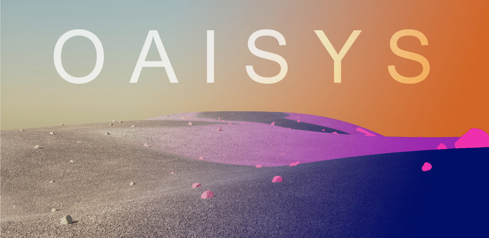

# Welcome to OAISYS



OAISYS (**O**utdoor **A**rtificial **I**ntelligent **SY**stems **S**imulator) is a simulator for unstructured outdoor environments that specifically considers the requirements of planetary robotics. The simulator is capable of generating large varieties of (planetary) outdoor scenes with rich generation of metadata, such as multi-level  semantic  and  instance  annotations. OAISYS is built upon the open source engine Blender, without requiring expert knowledge in rendering pipelines. For further information on how OAISYS works, we refer to the following presentation and the corresponding IROS21 conference paper, "A Photorealistic Terrain Simulation Pipeline for Unstructured Outdoor Environments".

To get started with OAISYS we recommand you to watch the [OAISYS video](https://www.youtube.com/watch?v=zXwYdT4yzTc) and complete the [Basic Tutorial](doc/wiki/basicExample/basicExample.md).

Important: Please be aware this repository is still under construction!

## Requirements

The current version of OAISYS works under Linux and is tested with the LTS Blender version 2.93.

## Tutorials

### Users
* [Basic Tutorial](doc/wiki/basicExample/basicExample.md): If this is the first time you are using OAISYS, you should go through this tutorial.
* Forest Scene: under construction
* Water World: under construction

### Developers
* Basic Developer Tutorial: under construction
#### Using the gRPC interface
[gRPC](https://grpc.io/) can be used to control the OAISYS simulation from an external process
***Installing grpcio wtih blender python pip***
We need to install grpcio with python included in blender. Therefore we need to get pip for blender
```
cd <blender_path>
cd 2.93 # (blender version)
python/bin/python3.9 lib/python3.9/ensurepip/__main__.py
```
We can now use pip3.9 and install required packages
```
python/bin/pip3.9 install grpcio google protobuf
```

***Using oaisys_client_ros***
`oaisys_client_ros` is a ROS package that interfaces with the OAISYS gRPC interface.
In order to install ROS, follow the installation instructions in this [document](http://wiki.ros.org/melodic/Installation).
Before we build the package, install the `catkin_grpc` dependency through the package manager.
```
apt install ros-melodic-grpc
```

Clone this repository into your catkin workspace and build the package
```
cd <catkin_ws_path>
git clone git@github.com:mgmatDLR/oaisys_external.git <catkin_ws_path>/src/oaisys
catkin build oaisys_client_ros
```

## Citation

If you use the simulator for your work, we would like to kindly ask to reference our OAISYS paper:

```bibtex
@InProceedings{Mueller2021,
	author    = {M{\"u}ller, Marcus G. and Durner, Maximilian and Gawel, Abel and St{\"u}rzl, Wolfgang and Triebel, Rudolph and Siegwart, Roland},
	title     = {{A Photorealistic Terrain Simulation Pipeline for Unstructured Outdoor Environments}},
	booktitle = {{IEEE/RSJ International Conference on Intelligent Robots and Systems}},
	year      = {2021}
}
```

---


