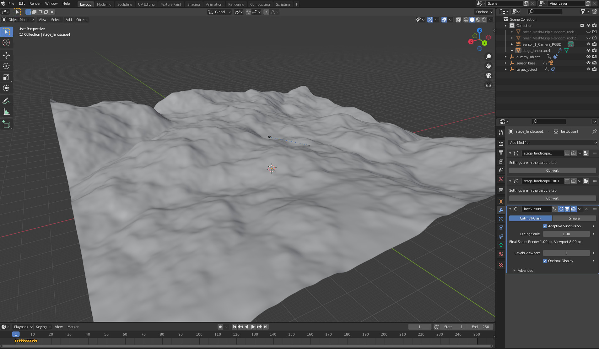
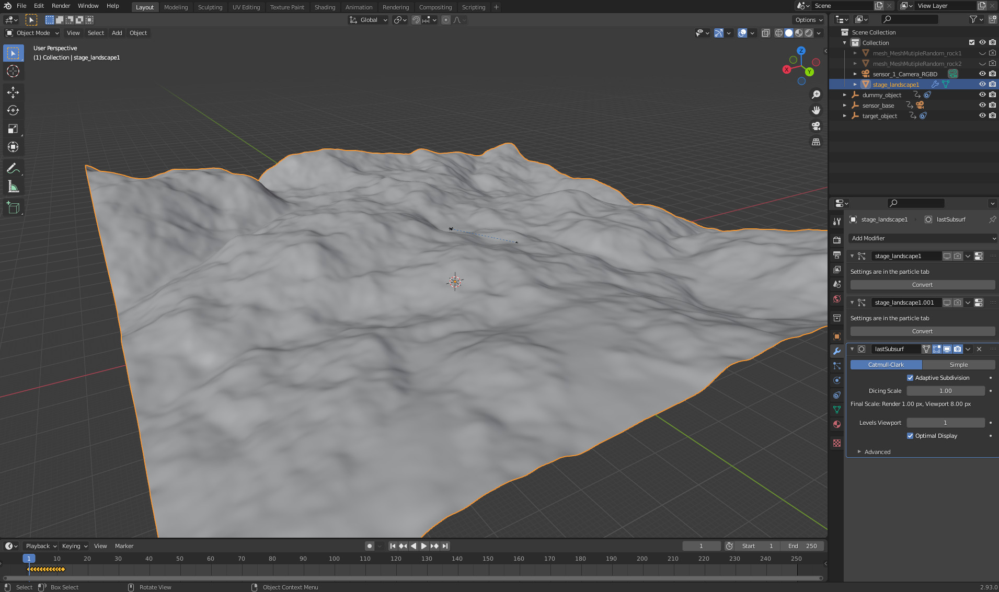
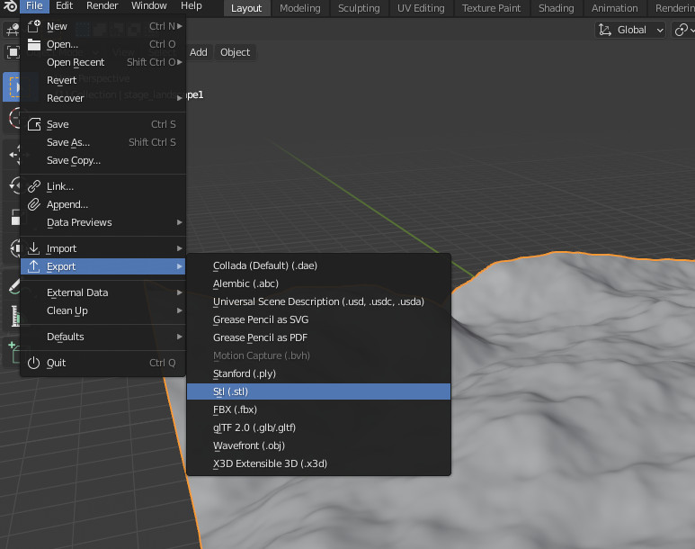
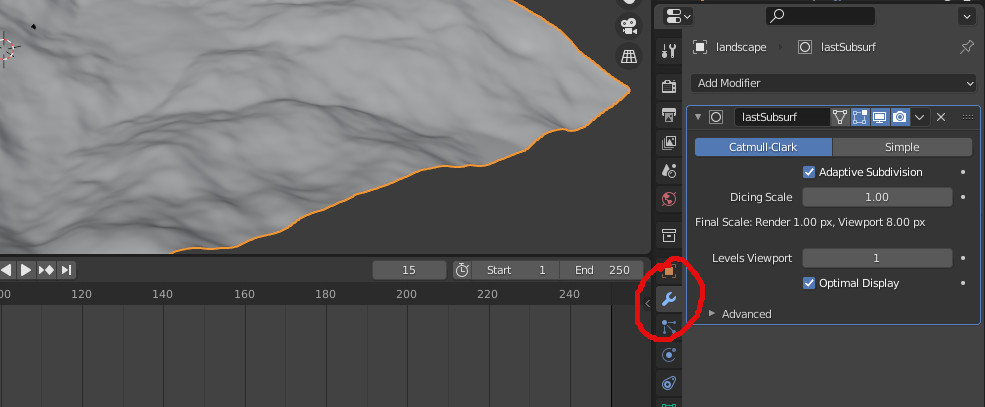
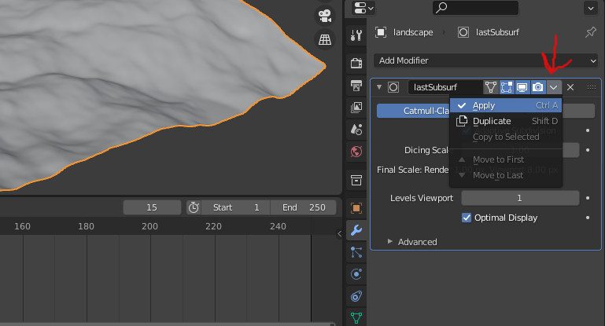

# Reuse landscape mesh

In this short tutorial, we will learn how to reuse landscape meshes, which where created before.

In some cases it might be helpful to reuse a specific landscape mesh again. This is easily possible with the [StageBlenderObject Module](../../../src/assets/stages/StageBlenderObject.py). In the following we will see how to use that module for that purpose.

## Create Landscape

First we create a landscape we want to reuse. For that we will make use of the [StageBlenderLandscape Module](../../../src/assets/stages/StageBlenderLandscape.py).
For that we can simply use the default cfg of OAISYS and modify it a bit. We can delete the object assets from the file, since we just want to extract the basic landscape mesh.


We do not need to render any images, since we are just intersted in the blender file. Therefore, we can set renderImages to false.
Furthermore we can set the number of batches and samples to a minimum. So just set it to 1.

As a result we are getting the following example cfg file:

```json
{
	"SIMULATION_SETUP": {
		"outputPath":"",
		"defaultCfg": "",
		"numBatches":1,
		"numSamplesPerBatch":1,
		"renderImages": false,
		"saveBlenderFiles": true,
		"outputIDOffset":0
	},

	"RENDER_SETUP": {

		"GENERAL": {
					"renderEngine":"CYCLES",
					"renderFeatureSet":"EXPERIMENTAL",
					"renderDevice": "GPU",
					"performanceTilesX": 256,
					"performanceTilesY": 256
					},

		"RENDER_PASSES": [{
							"type": "RGBDPass",
							"passParams": {
											"numIter": 1,
											"renderDepthActive": true,
											"renderSamples":128,
											"lightPathesMaxBounces": 6
										}
							},
							{
							"type": "SemanticPass",
							"passParams": {
											"numIter": 2,
											"renderSamples":1
										  }
							},
							{
							"type": "InstancePass",
							"passParams": {
											"numIter": 1,
											"renderSamples":1
										}
							}]
				
	},


	"RENDER_POST_PROCESSING_EFFECTS_SETUP": {
		"GENERAL": {
					"renderPasses": ["combined"]
					},
		"POST_EFFECTS": [
						]
				
	},


	"SENSOR_SETUP": {
		"GENERAL": {


					"baseMovement": {	"movementType": "randomEuclideanTarget",
										"hoverBaseModeEnabled": true,
									    "hoverBaseStage":"landscape01",
										"hoverBaseDistance":1.5,
										"hoverBaseDistanceNoise": 0.5
									},
					"sensorMovementType":"randomEuclideanTarget",
					"hoverBaseModeEnabled": true,
					"hoverBaseStage":"landscape01",
					"hoverBaseDistance":1.5,
					"hoverBaseDistanceNoise": 0.5,
					"hoverTargetModeEnabled": true,
					"hoverTargetStage":"landscape01",
					"hoverTargetDistance":0.0,
					"positionOffsetEnabled":true,
					"randomEuclideanPosMin": [-8.0,-8.0,0.0],
					"randomEuclideanPosMax": [8.0,8.0,5.0],
					"randomEuclideanEulerMin": [0,0,0],
					"randomEuclideanEulerMax": [0,0,0],
					"randomTargetPosMin": [-20.0,-20.0,-3.0],
					"randomTargetPosMax": [20.0,20.0,-0.2],
					"randomTargetEulerMin": [0,0,0],
					"randomTargetEulerMax": [0,0,0],
					"randomTargetRollDeg": [-10.0,10.0],
					"targetObjectActive":true,
					"tragetObjectMovementType":"random"},
		"SENSORS": [{"type": "SensorCameraRGBD",
					"sensorParams": {	
										"outputBaseName":"sensor_1",
										"imageResolution": [640,480],
										"KMatrix": [541.14,	0,			320,
													0,		541.14,		240,
													0,		0,			1],
										"transformation": [0.0,0,0,1.0,0.0,0,0],
										"triggerInterval": 1,
										"renderPasses": {
														"RGBDPass": {"activationSlot":[1], "DepthEnabled": true},
														"SemanticPass": {"activationSlot":[1,1]},
														"InstancePass": {"activationSlot":[1]}
														}
									}
					}]
	},

	"ENVIRONMENT_EFFECTS_SETUP": {

		"GENERAL": {"backgroundStrength": [0.1],
					"stepInterval": 1
					},

		"ENVIRONMENT_EFFECTS": [	{"type": "EnvLightBlenderSky",
									"stepInterval": 1,
									"environmentEffectsParams": {
																"stepIntervalOption": "GLOBAL",
																"stepInterval": 1,
																"SunSize": [0.545],
																"SunIntensity": [1.0],
																"SunElevation": [15.0,90.0],
																"SunRotation": [0.0,360.0],
																"SunAltitude": [3000.0,3350.0],
																"AirDensity": [1.0,2.0],
																"DustDensity": [0.0,10.0],
																"OzoneDensity": [0.0,5.0],
																"SunStrength": [0.0001,0.1],
																"passParams": 	{ "RGBDPass": {"rgbIDVec": [1,-1,-1,-1]},
																				  "SemanticPass": {"semanticIDVec": [500,500,500,500]},
																				  "InstancePass": {"instanceIDVec": [-1]}
																				}
															}

									}
								]
	},


	"ASSET_SETUP": {


		"GENERAL": {},


		"MATERIALS": [	{"name": "terrain_01",
						"type":"MaterialTerrain",
						"materialParams":{
											"general": {"minNumMixTerrains":1,
														"maxNumMixTerrains":2,
														"hardLabelBorders":true,
														"withReplacement":true,
														"dispMidLevel":0.0,
														"dispScale":1.0,
														"normalStrength":1.0,
														"mergingNoise": {
															"Scale": [3.0,7.0],
															"Detail": [1.0,3.0],
															"Roughness": [0.2,0.5],
															"Distortion": [0.0,0.6]
														}},
											"terrainTextureList": [
														{
															"templatePath": "oaisys_data/examples/assets/materials/rock_ground/rock_ground.json",
															"passParams": 	{ "rgb": {},
																			  "semantic_label": {"labelIDVec": [[30,500,5,2]]},
																			  "instance_label": {}
																			},
															"colorAdjustment": 	{
																"cColorPoints": [[0.70758,0.30417]],
																"rColorPoints": [[0.50909,0.48750]],
																"gColorPoints": [[0.5,0.5]],
																"bColorPoints": [[0.5,0.48750]]
															},
															"size": 120.0,
															"dispStrength": 0.03
														},
														{
															"templatePath": "oaisys_data/examples/assets/materials/dry_ground_01/dry_ground_01.json",
															"passParams": 	{ "rgb": {},
																			  "semantic_label": {"labelIDVec": [[30,500,5,2]]},
																			  "instance_label": {}
																			},
															"colorAdjustment": 	{
																"cColorPoints": [[0.70758,0.30417]],
																"rColorPoints": [[0.50909,0.48750]],
																"gColorPoints": [[0.5,0.5]],
																"bColorPoints": [[0.5,0.48750]]
															},
															"size": 120.0,
															"dispStrength": 0.03
														}
														]
								}}
					  ],

		"STAGES": [{"name": "landscape01",
					 "type": "StageBlenderLandscape",
					 "stageParams": {
							"stageName": "landscape",
							"stageSizeX": 200,
							"stageLandscapePreset": "another_noise",
							"assetMaterial": "terrain_01",
							"landscapeParams": {"random_seed":[0,1000]}
					 		}
					}
					],


		"MESHES": [ 
				]

	}

}
```

Once that is done we can run OAISYS, which will create our landscape:

`python run_oaisys.py --blender-install-path /path/to/blender/ --config-file /path/to/cfg/file/cfg_file.json`

## Extract data from blender file (optional)

In some cases you might want to get the mesh in a different output format to use it in other software. To do that open the created blender file.
Once you have done that, you might have to zoom a bit out depending on your scene (mouse wheel).



Whenever you see your terrain click on it.



If we want to get a high res model, we will have to apply the subsurface modifier. For that click on the 'Modifier Properties' button.



Press on the tiny arrow as shown in the figure and click apply.



Once the asset is activated you can go to File/Export/ and chose the output format you prefer:



Do NOT save the blender file, just close it.

## Reuse Landscape

Now we can use our landscape we created previously. For that we are making use of the [StageBlenderObject Module](../../../src/assets/stages/StageBlenderObject.py). In that you can specify the file you would like to load as stage. In our case that will be the created blendfile:

``` json
"STAGES": [{"name": "landscape01",
                     "type": "StageBlenderObject",
                     "stageParams": {
                            "meshInstanceName": "landscape",
                            "stageFilePath": "path/to/your/file/batch_0001/blender_file/TSS_batch_0001.blend",
                            "stageName": "landscape",
                            "stageDisplacementActive": false,
                            "assetMaterial": "terrain_01"
                             }
                    }
                    ],
```
