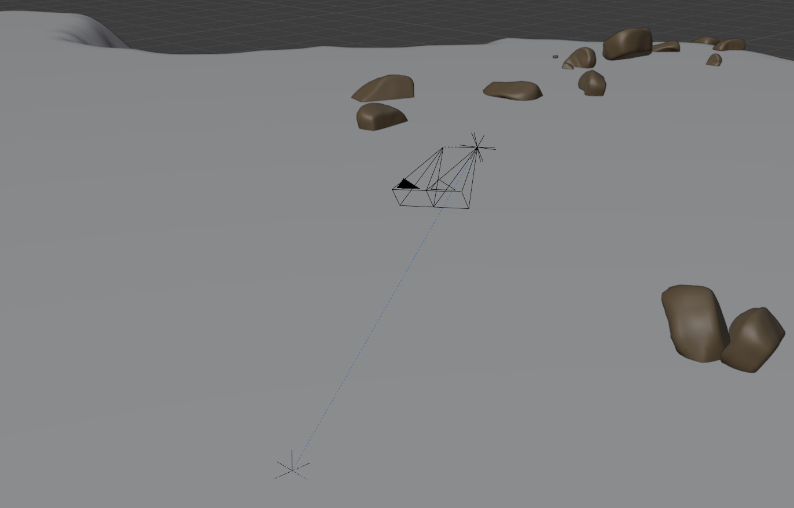

# Sensor Module

The sensor module is taking care of all sensors used for the simulator.
The sensor module has a base frame to which sensors can be attached, similar to the base of a robot.
When the base is moved, also the sensors are moved accordingly.
To move the sensor base frame, the user has several options and parameters, which are defined in the `GENERAL` part of the sensor cfg section.

## Sensor Movements

### Target Object


*The figure above illustrates the sensor base with two sensors attached to it and facing a target object, which position are sampled on the terrain surface.*

### Hover Mode

## CFG Structure and Parameters

The sensor module has two main parameter section; `GENERAL` and `SENSORS`.
The `GENERAL` section deals with general options and parameters for this module.
This includes the movement of the overall sensor base frame for instance.
The `SENSORS` section is a list of all sensors, which are added to the simulator.
In the following the different parameters are described.

### GENERAL

This section is responsible for the general parameters of the sensor module.

#### sensorMovementType

There are several movement types available:

1. _deterministic_: In the deterministic case, the movement can be provided by a csv file. For that provide the path to the csv file with the parameter `sensorMovementPose`. The format of the csv file should be [frameID, pos_x, pos_y, pos_z, quat_w, quat_x, quat_y, quat_z]. Hover mode cannot be activated.
2. _randomEuclidean_: 6D Poses are randomly sampled in the Euclidean space. Hover mode can be activated.
3. _randomEuclideanTarget_: 6D Poses are randomly sampled in the Euclidean space. Furthermore, the poses of a target object are sampled. The sensor base is always facing the target object. With that option, one can constraint the sensor base orientation more naturally. Hover mode can be activated.

_paramter type_: string

#### hoverBaseModeEnabled

Defines if hover mode is activated (_true_) or not (_false_)

_paramter type_: boolean


#### hoverBaseStage

Defines which stage is used for the hover mode option as height reference.

_paramter type_: string

#### hoverBaseDistance

Defines the distance to chosen stage in `hoverBaseStage`.

_paramter type_: float

#### hoverBaseDistanceNoise

Defines the absolute uniform noise which is applied to `hoverBaseDistance`.

_paramter type_: float

#### hoverTargetModeEnabled

Defines if hover mode is activated for target object (_true_) or not (_false_)

_paramter type_: boolean

#### hoverTargetStage

Defines which stage is used for the hover mode option of the target object as height reference.

_paramter type_: string

#### hoverTargetDistance

Defines the distance to chosen stage in `hoverTargetStage`.

_paramter type_: float

#### randomEuclideanPosMin

Defines the minimum limit for the position values. The notation is given by [min_pos_x, min_pos_y, min_pos_z]

_paramter type_: list

#### randomEuclideanPosMax

Defines the maximum limit for the position values. The notation is given by [min_pos_x, min_pos_y, min_pos_z]

_paramter type_: list

#### randomEuclideanEulerMin

Defines the minimum limit for the euler rotation values. The notation is given by [min_euler_1, min_euler_2, min_euler_3]

_paramter type_: list

#### randomEuclideanEulerMax

Defines the maximum limit for the euler rotation values. The notation is given by [min_euler_1, min_euler_2, min_euler_3]

_paramter type_: list

#### targetObjectActive

Defines if target object is used (_true_) or not (_false_)

_paramter type_: boolean

#### tragetObjectMovementType

1. randomEuclidean
2. randomEuclideanRelative

#### randomTargetPosMin

#### randomTargetPosMax

#### randomTargetEulerMin

#### randomTargetEulerMax

#### randomTargetRollDeg / randomTargetRollRad


### SENSORS

The following lists the parameters which a sensor item should have.

#### type

Defines the sensor type class which will be loaded

#### sensorParams

Defines the parameters for a specific sensor, which will be passed to it.
Besides the specific parameters for each sub sensor modules, there are a few parameters which should be defined in `sensorParams` independent of the type of the sensor, since they are used outside of the specific sensor module.

1. _outputBaseName_: This will define the base render name for all render passes of the specific sensor.
2. _transformation_: This provides the transformation from base to sensor, with the following notation: [pos_x, pos_y, pos_z, quat_w, quat_x, quat_y, quat_z]
3. _renderPasses_: This defines the behavior for the sensor, when the specific render pass is rendered.

#### Current Sensor List

The following sensors exist for the vanilla version of the simulator:

* [SensorCameraRGBD](sensors/doc/SensorCameraRGBD_doc.md)

### Example Cfg File

```json
{
"GENERAL": {
			"sensorMovementType":"randomPlaneTarget",
			"hoverBaseModeEnabled": true,
			"hoverBaseStage":"landscape01",
			"hoverBaseDistance":5.0,
			"hoverBaseDistanceNoise": 0.5,
			"hoverTargetModeEnabled": true,
			"hoverTargetStage":"landscape01",
			"hoverTargetDistance":0.0,
			"positionOffsetEnabled":true,
			"randomPlanePosMin": [-50.0,-50.0,0.5],
			"randomPlanePosMax": [50.0,50.0,5.0],
			"randomPlaneEulerMin": [0,0,0],
			"randomPlaneEulerMax": [0,0,0],
			"randomPlaneRollDeg": [-0.2,0.2],
			"randomTargetPosMin": [-40.0,-40.0,-3.0],
			"randomTargetPosMax": [40.0,40.0,-0.2],
			"randomTargetEulerMin": [0,0,0],
			"randomTargetEulerMax": [0,0,0],
			"randomTargetRollDeg": [-10.0,10.0],
			"targetObjectActive":true,
			"tragetObjectMovementType":"random"
			},
"SENSORS": [{"type": "SensorCameraRGBD",
	     "sensorParams": {	"outputBaseName":"rgbLeft",
				"imageResolution": [640,480],
			        "KMatrix": [541.14,	0,	320,
				            0,		541.14,	240,
				            0,		0,	1],
				"transformation": [1.0,0,0,1.0,0.0,0,0],
				"triggerInterval": 1,
				"renderPasses": {
						"RGBDPass": {"activationSlot":[1], "DepthEnabled": true},
						"SemanticPass": {"activationSlot":[1,1]},
						"InstancePass": {"activationSlot":[1]}
						}
				}
		},
	    {"type": "SensorCameraRGBD",
	     "sensorParams": {	"outputBaseName":"rgbRight",
				"imageResolution": [640,480],
			        "KMatrix": [541.14,	0,	320,
				            0,		541.14,	240,
				            0,		0,	1],
				"transformation": [0,0,0,1,0,0,0],
				"triggerInterval": 1,
				"renderPasses": {
						"RGBDPass": {"activationSlot":[0], "DepthEnabled": false},
						"SemanticPass": {"activationSlot":[1,0]},
						"InstancePass": {"activationSlot":[0]}
						}
				}
	    }]
}
```

