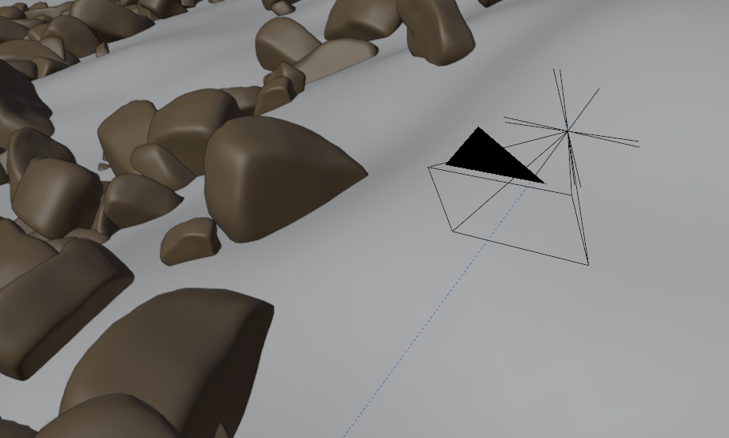

# SensorCameraRGBD

The SensorCameraRGBD module can simulate an RGB camera with depth information and semantic information. It is the basic sensor module of the simulator and uses the standard camera object of blender. It has multiple parameters to customize the camera model.


*Basic sensor model for the simulator.*

## Available Render Passes

At the moment the following render passes are supported by SensorCameraRGBD: RGBDPass, SemanticPass, InstancePass.

## Parameters

In the following the possible parameters for the module are described.

### outputBaseName

This parameter defines the name of the specific sensor. This name will also be used as base name for the rendering output.

type of parameter: string

### imageResolution

Resolution of camera [width, height]

type of parameter: list

### KMatrix

K matrix of camera. Defined as:

K = [focal length x,                0,            principle point x,
     0,                focal length y,            principle point y,
     0,                             0,                            1]

type of parameter: list

### transformation

Camera Position in relation to base frame.

type of parameter: list

### triggerInterval (optional)

Local trigger interval for camera if needed.

type of parameter: integer

### depthOfField (optional)

This parameter is optional and simulates the depth of field of the camera for the rgb channel. To control the amount of depth of field it uses the following parameters:
* _distance_: distance to object, which has to be sharp [meters]
* _fStop_: f stop (aperture) of the camera. This controls the amount of blurring.
* _blades_: number of blades of lens.
* _rotationDeg_: Rotate the polygonal blades along the facing axis [deg].
* _ratio_: Amount of distortion to simulate the anamorphic bokeh effect.

More information of the specific parameter can be found [here](https://docs.blender.org/manual/en/latest/render/cameras.html).

If not specified the following values are used:
* _distance_: 10.0
* _fStop_: 1.5
* _blades_: 0
* _rotationDeg_: 0
* _ratio_: 1.0

type of parameter: dict

### renderPasses (optional)

Render Pass information for camera. Check out specific render pass for more information.

type of parameter: dict

## Example cfg

```json
{"type": "SensorCameraRGBD",
 "sensorParams": {	
			"outputBaseName":"rgbLeft",
			"imageResolution": [640,480],
			"KMatrix": [541.14,	0,	320,
				    0,		541.14,	240,
				    0,		0,	1],
			"transformation": [1.0,0,0,1.0,0.0,0,0],
			"triggerInterval": 1,
			"depthOfField": {	"distance": 10.0,
						"fStop":1.5,
						"blades":0},
			"renderPasses": {
						"RGBDPass": {"activationSlot":[1], "DepthEnabled": true},
						"SemanticPass": {"activationSlot":[1,1]},
						"InstancePass": {"activationSlot":[1]}
					}
		}
}
```
